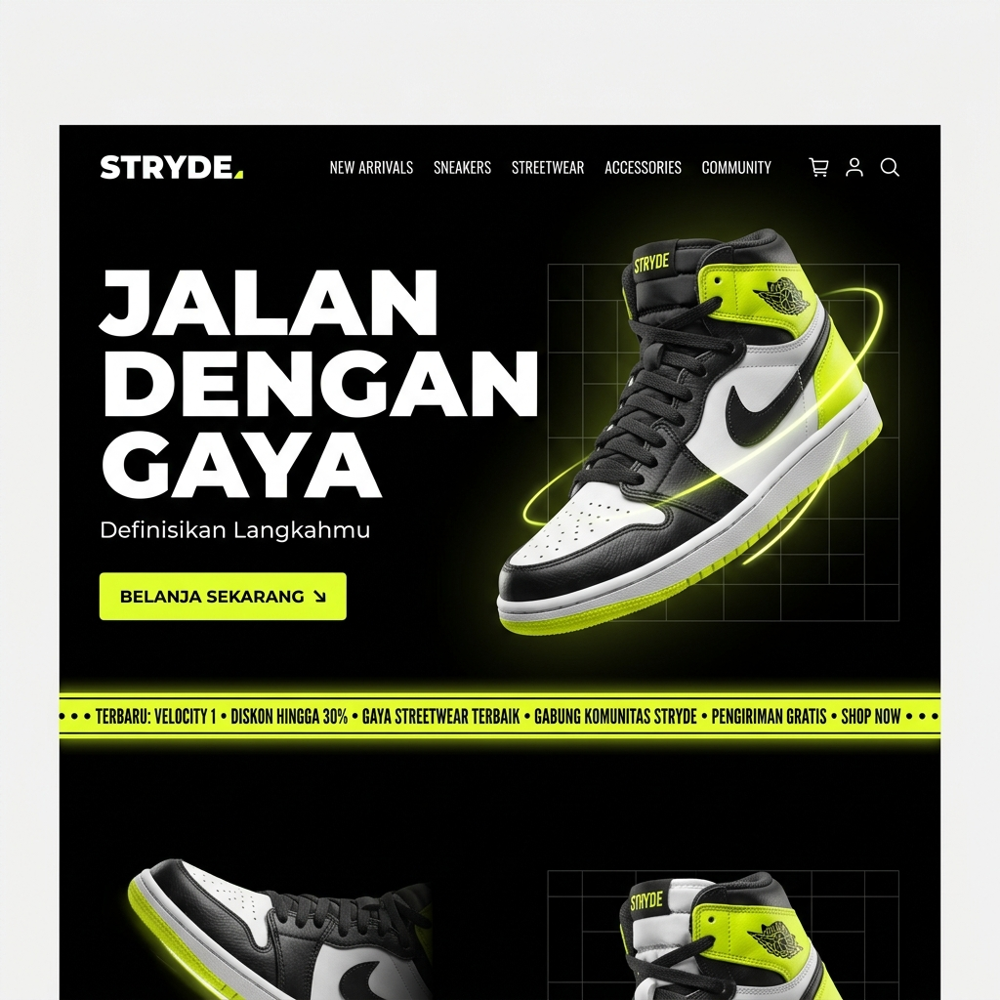
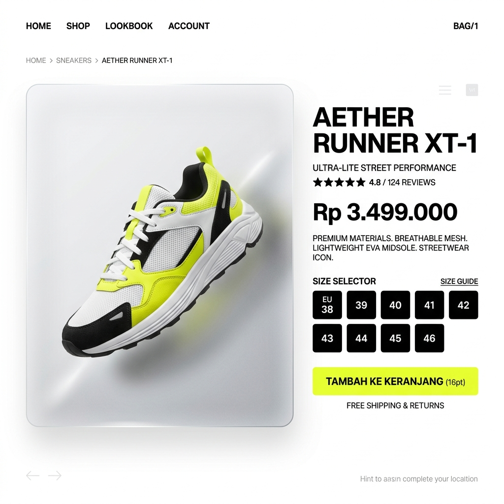
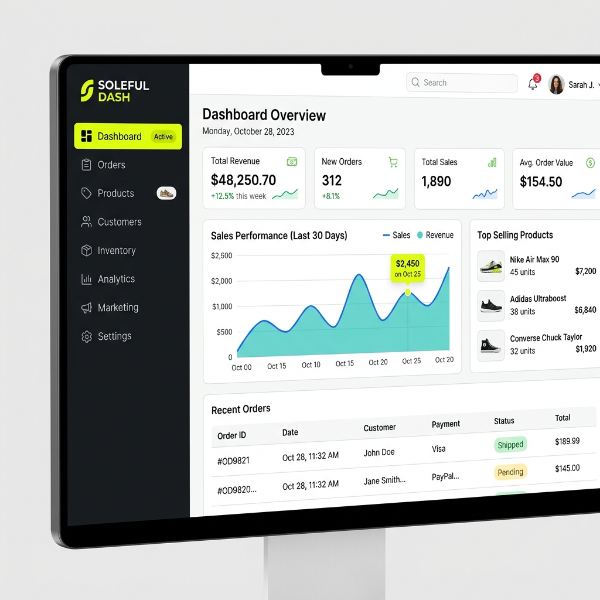

# STRYDE - Indonesian Shoe Brand E-Commerce Platform

A complete, production-ready e-commerce web application for **STRYDE** — an Indonesian shoe brand with the tagline **"Walk Your Way"**. Built with Next.js 14, TypeScript, Tailwind CSS, Supabase (PostgreSQL & Auth), Framer Motion, and Zustand.

## 📸 UI Previews

<div align="center">
  
  <p><em>Homepage with Framer Motion animations, Streetwear Aesthetic, and Infinite Marquee</em></p>
  
  <br/>
  
  
  <p><em>Premium Product Detail Page with Glassmorphism and High-Contrast Typography</em></p>

  <br/>
  
  
  <p><em>Modern Admin Dashboard for managing products, orders, and viewing revenue statistics</em></p>
</div>

## Project Overview

STRYDE is a full-featured e-commerce platform showcasing modern web development best practices with:
- Clean, minimalist design inspired by modern streetwear aesthetics
- Complete product catalog with real-time database integration
- Authentication system with Supabase (Login & Auto-login on Register)
- Multi-step checkout flow (Shipping & Payment)
- Full-featured Admin dashboard for managing products, orders, and viewing statistics
- Zustand for persistent client-side shopping cart state management
- Fully responsive (mobile-first) design

## Tech Stack

| Layer | Technology |
|-------|-----------|
| **Framework** | Next.js 14 (App Router) with TypeScript |
| **Styling** | Tailwind CSS + Lucide React Icons |
| **Fonts** | Plus Jakarta Sans (headings) + Inter (body) |
| **Database & Auth** | Supabase (PostgreSQL, Row Level Security, Auth) |
| **Forms & Validation** | React Hook Form + Zod |
| **State Management** | Zustand (Persistent Local Storage) |
| **Notifications** | Sonner Toast |

## Key Features

### User Experience
- **Authentication**: Secure email/password login and registration. Includes an automated bypass for email confirmation during registration (using Service Role Key) for seamless testing.
- **Product Catalog**: Dynamic product grids, filtering (category, price range), sorting (price, name, newest), and search.
- **Product Details**: Size selection, dynamic stock validation, quantity adjustment, and dynamic "Related Products" recommendation.
- **Shopping Cart**: Real-time subtotal, persistent cart items, and seamless integration with the checkout process.
- **Checkout Flow**: 3-step process (Shipping Info → Payment Method (COD/Transfer) → Order Summary & Success).
- **Order Management**: Users can view order history, status tracking, and upload payment proofs.

### Admin Dashboard (`/admin`)
- **Overview**: Revenue statistics, daily orders, and active products count.
- **Order Management**: View detailed order history, update order statuses (pending, processing, shipped, etc.), and verify uploaded payment proofs.
- **Product Management**: Full CRUD operations for the product catalog. Admins can update prices, stock per size, featured status, and upload new images.

## Design System

### Color Palette
- **Primary**: `#0A0A0A` (Near Black) - Main text and backgrounds
- **Accent**: `#E8FF3A` (Electric Yellow) - CTAs, badges, highlights
- **Background**: `#FFFFFF` (White) - Clean canvas
- **Muted**: `#F5F5F5` - Secondary backgrounds

### Typography & Spacing
- **Headings**: Plus Jakarta Sans
- **Body**: Inter
- **Border Radius**: 8px (cards), 6px (buttons), 999px (badges/pills)

## Getting Started

### Installation

```bash
# Clone the repository
git clone https://github.com/Torrayz/tokosepatu.git
cd tokosepatu

# Install dependencies
npm install
```

### Environment Setup
You must connect to your Supabase project. Add your credentials in `.env.local`:
```bash
NEXT_PUBLIC_SUPABASE_URL=your_supabase_url
NEXT_PUBLIC_SUPABASE_ANON_KEY=your_anon_key
SUPABASE_SERVICE_ROLE_KEY=your_service_role_key
```

### Running the App
```bash
# Start development server
npm run dev

# Build for production
npm run build

# Start production server
npm start
```

## Database Schema (Supabase)
The application relies on a solid relational database structure:
- `profiles`: User information and roles (`customer` or `admin`)
- `categories`: Product categories (Sneakers, Formal, Casual, etc.)
- `products`: Product details (price, description, images, active status)
- `product_sizes`: Inventory management per size
- `orders` & `order_items`: Transaction records and purchased items
- `payment_proofs`: Secure storage for uploaded transfer receipts

See `supabase/schema.sql` for the complete definition and Row Level Security (RLS) policies.

## License

This is a custom project for STRYDE. All rights reserved.
